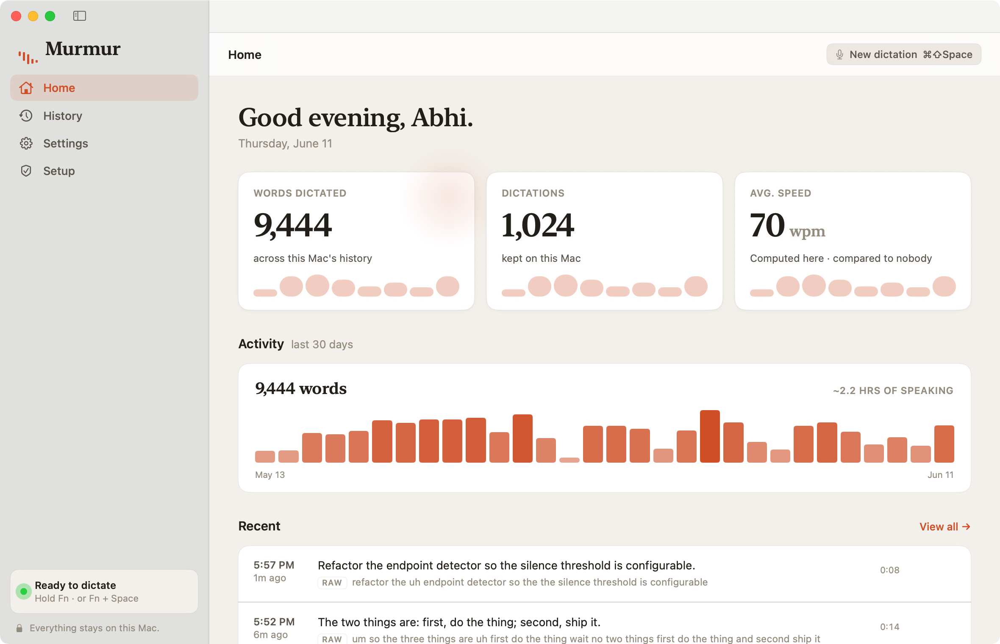

# Pomvox

[](https://github.com/abhiram304/pomvox/releases/latest)
[](#requirements)
[](LICENSE)
[](https://github.com/abhiram304/pomvox/releases)

Fully local, privacy-first voice dictation for macOS on Apple Silicon. Hold a
hotkey, speak, and the transcript is inserted into whatever text field is
focused — in any app. Speech-to-text runs on the Neural Engine and an optional
cleanup pass runs a local LLM on the GPU. **Your voice and transcripts never
leave your machine.** The only network calls are the one-time model download
from Hugging Face and — if you opt in — anonymous, content-free usage stats
(off by default; toggle in Settings → Privacy).

<p align="center">
  
</p>

Pomvox is a native SwiftUI menu-bar app (`Pomvox.app`): live two-tone draft as
you speak, a Hub window with your dictation history and settings, and a Setup
walkthrough for permissions. It runs from the menu bar, can launch at login, and
keeps a bounded, transcripts-only history you can search and wipe.

See [SPEC.md](SPEC.md) for the full product spec,
[ARCHITECTURE.md](ARCHITECTURE.md) for how the implemented system fits together,
and [CONTRIBUTING.md](CONTRIBUTING.md) to get involved.

> **Project status.** Pomvox began as a Python menu-bar app and is now a native
> Swift app. The native app is the daily driver; the original Python engine
> still ships in this repo as a runnable reference and the cross-checked test
> spec (see [Two engines](#two-engines)). A signed, notarized download is
> available on the [Releases page](https://github.com/abhiram304/pomvox/releases/latest);
> you can also build from source. The native engine is **off by default** until
> you enable it.

## Requirements

- Apple Silicon Mac (reference hardware: M1, 16 GB), macOS 14+
- [Xcode](https://developer.apple.com/xcode/) (full app, not just Command Line
  Tools) and [`xcodegen`](https://github.com/yonsm/XcodeGen) — `brew install xcodegen`
- [`uv`](https://docs.astral.sh/uv/) — only for the Python reference engine and
  the test suite

## Download

### Homebrew

```sh
brew install --cask abhiram304/pomvox/pomvox
```

This taps [`abhiram304/homebrew-pomvox`](https://github.com/abhiram304/homebrew-pomvox)
and installs the same notarized `Pomvox.app` into `/Applications`. Upgrade later
with `brew upgrade --cask pomvox`.

### Direct download

Grab the latest **notarized** `Pomvox.dmg` from the
[Releases page](https://github.com/abhiram304/pomvox/releases/latest), open it,
and drag **Pomvox** to Applications. It's signed with a Developer ID and notarized
by Apple, so it opens with no right-click dance.

Either way, launch Pomvox and grant the three permissions in **Setup**
(Microphone, Input Monitoring, Accessibility). Requires an Apple Silicon Mac on
macOS 14+.

## Install (build from source)

```sh
# 1. A stable self-signed identity so macOS keeps your permission grants across
#    rebuilds (without it, every rebuild resets Microphone/Accessibility/Input
#    Monitoring). One-time; needs a GUI auth prompt to trust the cert.
scripts/dev-signing-cert.sh

# 2. Generate the Xcode project and build OUTSIDE iCloud (codesign rejects the
#    extended attributes iCloud adds to a synced folder).
export DEVELOPER_DIR=/Applications/Xcode.app/Contents/Developer
cd Pomvox && xcodegen generate
xcodebuild -project Pomvox.xcodeproj -scheme Pomvox \
  -configuration Debug -derivedDataPath /tmp/pomvox-hub-dd build

# 3. Install to a stable path (launch-at-login and TCC grants need this — not a
#    DerivedData path).
cp -R /tmp/pomvox-hub-dd/Build/Products/Debug/Pomvox.app ~/Applications/
open ~/Applications/Pomvox.app
```

## First run

1. **Grant permissions.** Open the Hub window → **Setup**. It walks three grants
   with a live checklist and deep links into System Settings:
   - **Microphone** — to hear you.
   - **Input Monitoring** — for the global hotkey (after granting, relaunch
     Pomvox once; macOS doesn't extend this grant to an already-running app).
   - **Accessibility** — to paste via ⌘V. The Setup pane's *insertion self-test*
     confirms it end-to-end.
2. **Set the Globe key to Do Nothing.** System Settings → Keyboard → "Press 🌐
   key to" → **Do Nothing**, otherwise macOS intercepts Fn before Pomvox sees
   it.
3. **Enable the engine.** Settings → *Native engine* → on. It arms the hotkey,
   loads the speech model (first run downloads parakeet-tdt-0.6b-v3, ~1.2 GB),
   and is ready in a second or two.
4. **(Optional) Launch at login.** Settings → General → *Launch at login*.
   Pomvox then comes up in the menu bar at login, already armed — zero clicks
   from login to dictating.

## Usage

- **Push-to-talk:** hold `Fn`, speak, release → text appears at the cursor.
- **Hands-free:** `Fn+Space` to start; it auto-stops on a natural pause (or press
  `Fn+Space` / tap `Fn` to stop).
- **Cancel:** `Esc` while recording discards the utterance — nothing is inserted.

A floating HUD shows a live two-tone draft (settled words bright, the newest
chunk dimmed) while you speak, then "finishing…" during cleanup. The menu-bar
icon mirrors engine state, and has **Open Hub…**, an engine toggle, and Quit.

## The Hub

The Hub window (menu bar → **Open Hub…**, or the Dock icon while it's open):

- **Home** — words / dictations / average WPM, a 30-day activity strip, and your
  recent dictations as two-tone raw→clean pairs.
- **History** — raw vs. cleaned side by side, search, copy / re-insert / delete /
  delete-all. Local-only sqlite at `~/.pomvox/history.db`: **transcripts only —
  audio is never stored** — rows auto-delete after `[history] retention_days`
  (default 7; `0` keeps nothing, `enabled = false` writes nothing).
- **Settings** — models, hotkeys, cleanup, HUD, launch-at-login. Cleanup/HUD
  edits apply live; model changes re-arm.
- **Setup** — the live permission checklist and insertion self-test.

## Configuration

Settings are edited in the Hub; everything also lives in `~/.pomvox/config.toml`
(comment-preserving — hand edits and unknown sections survive). Copy
[`config.example.toml`](config.example.toml) for the full set. Highlights:

- `[cleanup]` — `enabled`, `model`, `style` (`light` = fillers/punctuation only;
  `polish` also smooths rambles), `timeout_s` (on timeout the raw transcript is
  inserted — Pomvox never loses your words to a slow model).
- `[history]` — `retention_days`, `enabled`.
- `[engine] native` — the native engine toggle (the app owns this; the Hub flips
  it).

Anything model-shaped is a config value, never a constant — swap STT and cleanup
models to trade speed for quality on your hardware.

## Privacy

Your voice and transcripts never leave this Mac — that's the whole point, and it
isn't negotiable. The cleanup LLM and speech model both run on-device.

The only network calls Pomvox ever makes are:

1. The one-time model download from Hugging Face.
2. **Optional, anonymous usage stats** — off by default. On first run Pomvox
   shows a one-time prompt; you can also flip it anytime in **Settings →
   Privacy**, which spells out exactly what's sent.

If you turn the stats on, Pomvox sends a random per-install ID (anonymous) plus
content-free counters: app/OS version, that a dictation happened with its
duration, which models ran, whether cleanup was used, and enum-only error codes.
It **never** sends audio, transcripts, cleaned text, file paths, or any free
text — there is no field in the payload that could carry them. Being opt-in,
anonymous, and open source is the point: you can read exactly what leaves in
[`Telemetry.swift`](Pomvox/Sources/Telemetry.swift). The Python reference engine
makes no network calls at all.

## Two engines

This repo contains two implementations that share `~/.pomvox/config.toml` and
`~/.pomvox/history.db`:

- **Native Swift engine** (`Pomvox.app`, `Pomvox/`) — the daily driver. STT on
  the Neural Engine ([FluidAudio](https://github.com/FluidInference/FluidAudio)),
  cleanup on the GPU ([mlx-swift](https://github.com/ml-explore/mlx-swift)).
- **Python engine** (`src/pomvox/`, `uv run pomvox`) — the original app, now
  frozen as a runnable reference. Its pure-logic modules (state machines,
  endpointer, history, onboarding) are Linux-tested and remain the **spec** the
  Swift port is checked against, vector for vector.

Only one engine runs at a time — a pidfile (`~/.pomvox/engine.pid`) enforces
mutual exclusion, so the single writer to `history.db` is guaranteed. Run the
Python engine with `uv run pomvox` (see `uv run pomvox --check` for a permission
report); note that under `uv run` the TCC grants attach to your terminal app,
not to Pomvox.

## Development

See [CONTRIBUTING.md](CONTRIBUTING.md). The pure-logic modules have no platform
dependencies, so the Python spec suite runs anywhere; the Swift ports are
checked against the same vectors.

```sh
uv run pytest                                              # Python spec suite
export DEVELOPER_DIR=/Applications/Xcode.app/Contents/Developer
xcodebuild test -project Pomvox/Pomvox.xcodeproj -scheme Pomvox \
  -derivedDataPath /tmp/pomvox-hub-dd -destination 'platform=macOS'
```

Latency and footprint claims in PRs come with numbers from a real Apple Silicon
run, never assumed (CONTRIBUTING rule 4). The native-engine feasibility work and
its measured gates are in [docs/native-swift-path.md](docs/native-swift-path.md).

### Releasing a signed build

Day-to-day builds use a free self-signed cert (`scripts/dev-signing-cert.sh`).
Distribution uses **Developer ID + hardened runtime + notarization** — the
`Release` config in `Pomvox/project.yml`, driven by:

```sh
scripts/notarize-release.sh   # build → sign → notarize → staple → dist/Pomvox.zip
```

One-time setup (Developer ID cert in Xcode + a `notarytool` keychain profile) is
documented in the script header. Debug builds are untouched: same self-signed
identity, hardened runtime off, so TCC grants survive iterative work. The first
launch of a Release build re-prompts the three permissions once (the code
identity changed).

---

Built by [Abhi Ram Salammagari](https://www.abhiramsalammagari.com). Licensed
under the [MIT License](LICENSE).
